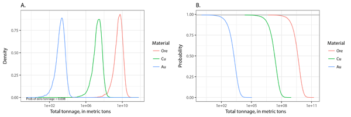
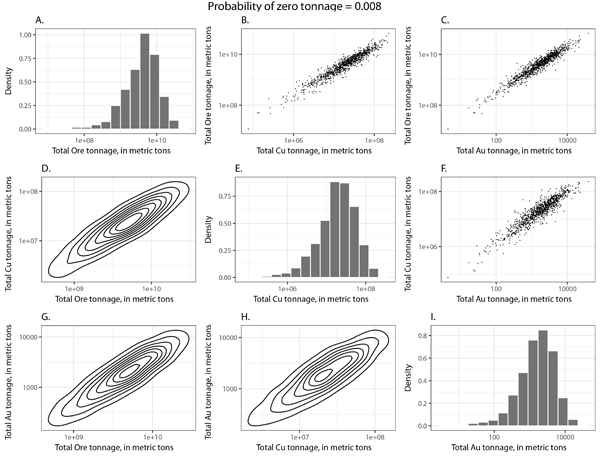
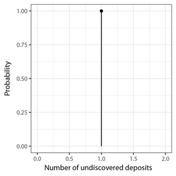

# Introduction
MapMark4 is a software package that implements the probability calculations in three-part mineral resource assessments. The name is derived from the descriptive phrase “mineral assessment program mark4”—the name “mark4” is chosen because the previous, similar program was called “mark3” (Root and others, 1992). Functions within the software package are written in the R statistical programming language, which is called either “R language” or “R” in this user’s guide. These functions, their documentation, and a copy of this user’s guide are bundled together in R’s unit of sharable code, which is called a “package.” MapMark4 provides the essential R functions to perform the probability calculations but does not provide a graphical user’s interface.

This user’s guide provides an overview of the MapMark4 package, showing you how to use the functions to carry out the probability calculations. As an overview, the scope of this user’s guide is limited. It does not provide detailed descriptions of the functions because this information is available in the package Help. It describes neither the underlying probability model nor the mathematics of the calculations, because this information is published in Ellefsen (2017).

We assume that you are familiar with the R language, statistical methods, compositional data analysis, and the method of three-part mineral resource assessment. That is, we assume that you are an advanced user. Furthermore, we assume that you are using the Windows operating system. If not, then you must modify those steps in the user’s guide that are related to files and directories.

The goals of this user’s guide are most readily achieved by showing the step-by-step calculations for an actual dataset. Thus, the package includes two datasets for your use. This user’s guide includes the R-language scripts that carry out the step-by-step calculations on these datasets. We strongly encourage you to execute these scripts yourself because this effort will help you become familiar with the calculations.

This user’s guide focuses primarily on probability calculations involving grade and tonnage models, which specify ore tonnage and mineral resource grades. However, probability calculations also can be performed for tonnage models, which specify contained metal tonnage. These calculations are described in Appendix 1.

In this user’s guide, R language scripts, program variables, data structures, and so on are typeset using the Courier New font.

# Overview of Probability Calculations
The probability calculations are conveniently divided into six groups, which are implemented as software classes. The first class pertains to the metadata that describes the permissive tract. The metadata are encapsulated in an S3 class, which is one type of an R language class (R Core Team, 2015). This class is named “Metadata.”

The second software class pertains to the mass of ore in an undiscovered deposit within the permissive tract. The units for mass that are commonly used by economic geologists are metric tons (1,000 kilograms). When using units of metric tons, mass traditionally is called “tonnage,” and this term is used in the remainder of this user’s guide. The ore tonnages in an undiscovered deposit are represented by a probability density function (pdf) that accounts for uncertainty. This pdf is estimated from known ore tonnages in discovered deposits. These and related computations are encapsulated in an S3 class that is named “TonnagePdf.” 

The third software class pertains to the grades of the mineral resources in an undiscovered deposit within the permissive tract. The units for grades that are commonly used by economic geologists are percentages. The grades in an undiscovered deposit are represented by a pdf that accounts for uncertainty. This pdf is generated from known grades in discovered deposits. These and related computations are encapsulated in an S3 class that is named “GradePdf.” 
The fourth class pertains to the number of undiscovered deposits within the permissive tract. This number is represented by a probability mass function (pmf) that accounts for uncertainty. The pmf is generated from estimates of the number of undiscovered deposits that are made by the assessment geoscientists. These and related computations are encapsulated in an S3 class that is named “NDepositsPmf.”

The fifth class pertains to the simulation of undiscovered deposits within the permissive tract. The undiscovered deposits are simulated using information from classes TonnagePdf, GradePdf, and NDepositsPmf. The computations are encapsulated in an S3 class that is named “Simulation.”

The sixth class pertains to summary statistics for the simulated undiscovered deposits. The summary statistics are the total ore and mineral resource tonnages in all simulated undiscovered deposits within the permissive tract. These total ore and mineral resource tonnages are represented by a pdf that accounts for uncertainty. These computations and related computations are encapsulated in an S3 class that is named “TotalTonnagePdf.”

The general relations among the inputs to the probability calculations, the six software classes, and the output are conveniently summarized by the diagram in figure 1. 


# Data for Probability Calculations
## Grade and Tonnage Model

For your probability calculations, you will need a grade and tonnage model that is pertinent to your mineral resource assessment. To understand the components of a grade and tonnage model, examine the example model that is provided with the package. To accomplish this task, type the following R scripts in the R console window:
```
library(MapMark4)
ExampleGatm
```
The grade and tonnage model is printed in the R console window. Here are the first five lines of the entire model:
```
           ID         Name      Ore          Cu           Au  
1  DepositID1 DepositName1  147204645 0.5203261 4.911163e-05
2  DepositID2 DepositName2   25973547 0.3026978 3.975937e-05
3  DepositID3 DepositName3  220751458 0.6024545 1.726491e-05
4  DepositID4 DepositName4   97091334 0.4439770 3.505726e-05
5  DepositID5 DepositName5 2139367354 0.5893846 3.232766e-05
```
The first column lists unique identifiers for the discovered deposits. The second column lists the names of discovered deposits. In practice, two or more discovered deposits occasionally have the same name, so you should not rely on the name to  identify the deposit. The third column lists the tonnage of the ore. The fourth and subsequent columns list the mineral resource grades. This computer-generated dataset comprises 71 discovered deposits, so there are 71 rows in `ExampleGatm`. 

A grade and tonnage model, including this example model, is stored within an R session as an R language data frame. The information in the first and second columns is not used in MapMark4, so MapMark4 places no constraints on the information in these columns. However, this is not the case for the remaining columns. The third column, which lists the ore tonnages, must not have any missing values. Furthermore, all tonnages must be positive—that is, zero-valued and negative-valued tonnages are prohibited. The units for ore tonnage are metric tons. The fourth and subsequent columns, which list the mineral resource grades, must not have any missing values. The mineral resource grades are expressed with percent. All grades must be between 0 and 100—that is, they cannot equal 0 or 100. 

## Estimates of the Number of Undiscovered Deposits

For your probability calculations, you will also need the estimates of the numbers of undiscovered deposits within a permissive tract. These estimates are generated by the members of the assessment team. To see an example of such estimates, type the following R script:
```
ExampleDepEst1
```
The estimates are printed in the R console window:
```
      Name Weight N90 N50 N10
1  person1   0.50   3  10  25
2  person2   1.00   2   5  10
3  person3   1.00   5   7  10
4  person4   1.00   2  10  20
5  person5   1.00   1   2   4
6  person6   3.00   3  10  20
7  person7   1.00   5  10  20
8  person8   1.00   3   5   7
9  person9   1.00   1   2   5
10 person10  0.01  10  20  60
```

The “Name” column lists either the names of assessment team members or other appropriate identifiers. The  “Weight” column lists the weights associated with the estimates, which are described later. The N90 column lists, for each member, the estimated number of undiscovered deposits at a probability of 0.90. For example, person6 estimates that there is a 0.90 probability of finding three  or more undiscovered deposits in the permissive tract. Among assessment geoscientists, this probability is called an “elicitation percentile of 90.” The N50 and N10 columns are similar and list, for each member, the estimated number of undiscovered deposits at elicitation percentiles of 50 and 10. Some additional information about ExampleDepEst1 is available in the package Help.

It is desirable to weight the estimates associated with each assessment team member—a weight specifies the extent to which a member’s estimates affect the calculated probability mass function. For most team members, the weight should be 1, which is the standard value. If a team member is an expert, then the weight for that member should be greater than 1. For example, person6 is an expert, so the weight is set to 3. If the team member is a novice, then the weight for that member should be less than 1. For example, person1 is a novice, so the weight is set to 0.5. If the estimates by a team member different significantly from the estimates by other team members, then the weight should be small. For example, the estimates for person10 are anomalous, so the weight is 0.01. 

The set of estimates of the number of undiscovered deposits is stored within an R session as an R language data frame. The information in the first column is not used in MapMark4, so MapMark4 places no constraints on the information in this column. However, this is not the case for the remaining columns. The second column, which lists the weights, must not have any missing values. Furthermore, the weights must be positive—that is, zero-valued and negative-valued weights are prohibited. The third, fourth, and fifth columns, which list the estimated numbers of undiscovered deposits, must not have any missing values. Furthermore, for each team member, the three estimated numbers must be in increasing order. For example, the estimates for person6, which are 3, 10, and 20, are in increasing order. However, estimates such as 3, 2, and 20 would not be. 

The package includes three other examples of estimates generated by assessment teams: `ExampleDepEst2`, `ExampleDepEst3`, and `ExampleDepEst4`.

# Preparatory steps

We suggest that you create a computer directory for the probability calculations. A suitable name for the directory is the tract identifier, which is a character string specifying the permissive tract. For example, assume that the tract identifier is `PT001`, so the name of the directory would be `PT001`. Within the R session, set the working directory to `PT001`. For example, if the complete path is `F:\tmp\PT001`, then use the script:
```
setwd("F:\\tmp\\PT001")
```
The double slashes are required for the Windows operating system. 

The directory should include both the grade and tonnage model and the estimates of the number of undiscovered deposits. For the example presented in this user’s guide, the datasets included in the package are used; these datasets are written into files within the directory using these scripts:
```
write.csv(ExampleGatm, file = "myGatm.csv", row.names = FALSE)
write.csv(ExampleDepEst1, file = "myDepEst.csv", row.names = FALSE)
```

Of course, if you are using MapMark4 for an actual assessment, you already should have the two corresponding files for your assessment in your working directory.
We suggest that, in the directory, you create a file to contain all of the R language scripts that you use to perform the probability calculations. Such a file is valuable for at least two reasons. First, the file is a record of how the calculations are performed; this record ensures that the calculations are reproducible. Second, modifying a calculation is relatively easy in most cases; only the associated R language script in the file is edited. Creating this file is easy. Just copy the R language scripts from this user’s guide into the file and modify them appropriately. 

# Probability Calculations
## Metadata

Class `Metadata` records information about the permissive tract. This class is instantiated (that is, created and initialized) with this script: 
```
oMeta <- Metadata("PT001", "myGatm.csv", "myDepEst.csv",
         seed = 7, tractName = "Lucky Strike",
         depositModel = "Computer generated gatm with copper and gold",
         personName = "Mary Doe",
         otherInfo = "This is an example assessment.")
```
The first argument is the tract identifier, which is a character string that uniquely identifies the tract. The tract identifier is used to generate file names for which the associated files record information about the probability calculations. Consequently, it is important to pick a tract identifier that is also suitable for file names—it should not contain nonstandard characters. The second argument is the name of the file containing the grade and tonnage model. The third argument is the name of the file containing the estimates of the number of undiscovered deposits that were made by the assessment team. The remaining arguments are optional. Argument `seed`, which is a positive integer, is used to set the state of the random number generator. If seed is specified, then probability calculations will always yield the same results—the probability calculations will be exactly reproducible. Argument `tractName` is the name of the tract. Argument `depositModel` is the name of the descriptive model used for the mineral resource that is being assessed (Singer and Menzie, 2010, p. 29–41). Argument `personName` is the name of the person performing the probability calculations. Argument `otherInfo` contains additional information regarding the probability calculations and the assessment itself. 

This script 
```
summary(oMeta)
prints the following summary to the R console: 
Metadata   for the permissive tract
------------------------------------------------------------
Tract identifier: PT001
Name of file containing the model: myGatm.csv
Name of file containing the estimates of the number of deposits: myDepEst.csv
Seed: 7
Tract name: Lucky Strike
Deposit model: Computer generated gatm with copper and gold
Calculation date: Fri Dec 09 11:13:08 2016
Name of person performing the calculations: Mary Doe
Other information: This is an example assessment.

###############################################################
```

Notice that the summary includes an additional field `Calculation date`, which is the date and time that the probability calculations are performed. This field can be set manually using an argument to function `MetaData`—see the package Help for details.

## Distribution for the Ore Tonnages

Class `TonnagePdf` generates the pdf that represents the ore tonnages in an undiscovered deposit within the permissive tract. The pdf is estimated from the grade and tonnage model, which is described in section “Data for probability calculations.” The grade and tonnage model is read with this script:
```
gatm <- read.csv(getModelFilename(oMeta))
```
Function `getModelFilename` gets the name of the file containing the grade and tonnage model from the metadata, and then function `read.csv` reads that file. Then class `TonnagePdf` is instantiated with this script:
```
oTonPdf <- TonnagePdf(gatm, seed = getSeed(oMeta))
```
The first argument is the R-language data frame containing the grade and tonnage model. The second argument `seed` is set to the value that is stored in the metadata, which is obtained with function `getSeed`. There are two additional, optional arguments to function `TonnagePdf` that are particularly important. Argument `pdfType` specifies the type of pdf. The default type is `normal`, which is a normal pdf. The other available type is `kde`, which is a kernel density estimate. Argument `isTruncated` specifies whether the pdf is truncated at the lowest and highest ore tonnages in the grade and tonnage model. The default value is `FALSE`, and the other value is `TRUE`.

When there are less than roughly 50 discovered deposits in the grade and tonnage model, there are, of course, few ore tonnages with which to estimate the pdf. In such cases, we suggest that you use the normal pdf. Conversely, when there are more than roughly 50 discovered deposits in the grade and tonnage model, you might consider using the kernel density estimate pdf. These guidelines are not rules, so you should check the pdfs generated with both methods. 

A simple way to check the pdf is to plot both it and its cumulative distribution function (cdf): 
```
plot(oTonPdf)
```
The resulting plot is shown in figure 2. Notice that both horizontal axes are logarithmic because the range of the ore tonnage is enormous. In fig. 2A, the pdf, which is represented by the histogram, spans the range of the ore tonnages from the grade and tonnage model. Furthermore, the pdf is large exactly where the density of ore tonnages is high (that is, roughly 3×107 to 1×109 metric tons). In fig. 2B, the cdf matches the empirical cdf. Thus, we conclude that the pdf adequately represents the ore tonnages in the grade and tonnage model.


Deviance (fig. 2B) is a statistic that quantifies the misfit between the ore tonnages from the discovered deposits and the pdf that represents those ore tonnages. Small values indicate a better fit than large values do. This information can help you decide which type of pdf is best suited for your data.

This script
```
summary(oTonPdf)
```
prints the following summary to the R console:
```
Summary comparison of the pdf representing the tonnage
and the actual tonnages in the model.
------------------------------------------------------------
Pdf type: normal
Pdf is not truncated.
Number of discovered deposits in the model: 71

Deviance = -26.0251
------------------------------------------------------------
This table pertains to the log-transformed tonnages.
Column Gatm refers to the actual tonnages in the
grade and tonnage model; column Pdf refers to the pdf 
representing the tonnages.
                    Gatm   Pdf
Minimum            15.10 11.50
0.25 quantile      18.00 18.00
Median             19.00 19.00
0.75 quantile      20.30 20.10
Maximum            22.20 26.20
Mean               19.00 19.00
Standard deviation  1.49  1.49
------------------------------------------------------------
This table pertains to the (untransformed) tonnages.
Column Gatm refers to the tonnages in the grade and
tonnage model; column Pdf refers to the pdf representing the tonnages.
                       Gatm      Pdf
Minimum            3.70e+06 9.73e+04
0.25 quantile      6.64e+07 6.85e+07
Median             1.72e+08 1.87e+08
0.75 quantile      6.26e+08 5.13e+08
Maximum            4.39e+09 2.35e+11
Mean               4.67e+08 5.68e+08
Standard deviation 6.89e+08 1.61e+09

###############################################################
```

It is common that the corresponding statistics differ somewhat. For statistics calculated with log-transformed ore tonnages, the differences should be small. There are two possible exceptions: The minimum and the maximum might differ a lot, if the pdf is not truncated. 
For statistics calculated with untransformed ore tonnages, the differences between corresponding statistics may be large. The reason is that the pdf is fit to the log-transformed tonnages, not the untransformed tonnages. When the random samples of the log-transformed tonnages undergo exponentiation to transform them to tonnages, the small differences are greatly magnified. 

## Distribution for the Grades

Class `GradePdf` generates the pdf that represents the grades in an undiscovered deposit within the permissive tract. The pdf is estimated from the grade and tonnage model, which is described in section “Data for probability calculations.” This class is instantiated with this script:
```
oGradePdf <- GradePdf(gatm, seed = getSeed(oMeta))
```
This script requires several seconds to complete its calculations. The first argument is the R-language data frame containing the grade and tonnage model. The second argument `seed` is set to the value that is stored in the metadata, which is obtained with function `getSeed`. There are two additional, optional arguments to function `GradePdf` that are particularly important. Argument `pdfType` specifies the type of pdf. The default type is `normal`, which is a normal pdf. The other available type is `kde`, which is a kernel density estimate. The guidelines for selecting `pdfType` are the same as those for class `TonnagePdf`. Argument `isTruncated` specifies whether the pdf is truncated at the lowest and highest grades in the grade and tonnage model. The default value is `FALSE`, and the other value is `TRUE`.

A simple way to check the pdf is to plot the log-ratios of its grades: 
```
plot(oGradePdf)
```
The resulting matrix of plots is shown in figure 3. For this grade and tonnage model, there are three log-ratios—copper-gold, copper-gangue, and gold-gangue. Thus, there are three distributions that must be shown.


Consider the copper-gold log-ratio. In fig. 3A, the histogram pertains to the log-ratios of copper and gold grades—these two sets of grades come from the joint pdf that represents the grades. The corresponding log-ratios calculated from the grade and tonnage model (vertical red lines) match the histogram. In fig. 3D, the cdf (solid line) pertains to the log-ratios of the copper and gold grades from the joint pdf. The empirical cdf (red dots) pertains to the log-ratios calculated from the grade and tonnage model. The cdf matches the empirical cdf. The same findings apply to the other sets of log-ratios (fig. 3B, C, E, and F). Thus, we conclude that the pdf for the grades adequately represents the grades in the grade and tonnage model.

This script
```
summary(oGradePdf)
```
prints the following summary to the R console:
```
Summary comparison of the pdf representing the grades
and the actual grades in the grade and tonnage model.
------------------------------------------------------------
Pdf type: normal
Pdf is not truncated.
Number of discovered deposits in the grade and tonnage model: 71
Number of resources: 2
------------------------------------------------------------
Quantiles (reported in percent)
Column Gatm refers to the actual grades from the grade and
model; column Pdf refers to the pdf representing the grades.
Component: Cu
              Gatm     Pdf
Minimum       0.149 0.0373
0.25 quantile 0.287 0.3110
Median        0.452 0.4430
0.75 quantile 0.629 0.6310
Maximum       1.450 6.0900

Component: Au
                  Gatm      Pdf
Minimum       1.31e-05 2.11e-06
0.25 quantile 2.48e-05 2.60e-05
Median        3.95e-05 3.76e-05
0.75 quantile 5.02e-05 5.44e-05
Maximum       2.58e-04 6.46e-04

Component: gangue
              Gatm   Pdf
Minimum       98.6  93.9
0.25 quantile 99.4  99.4
Median        99.5  99.6
0.75 quantile 99.7  99.7
Maximum       99.9 100.0

------------------------------------------------------------
Compositional mean (reported in percent)
Column Gatm refers to the actual grades from the grade and
model; column Pdf refers to the pdf representing the grades.
           Gatm      Pdf
Cu     4.43e-01 4.43e-01
Au     3.76e-05 3.76e-05
gangue 9.96e+01 9.96e+01
------------------------------------------------------------
Composite variation matrix
          Cu    Au gangue
Cu     0.000 0.510  0.278
Au     0.510 0.000  0.301
gangue 0.278 0.301  0.000


Explanation
The composite variation matrix has two parts: its upper
triangle and its lower triangle. The upper triangle is
the upper triangle of the variation matrix for the actual
grades in the grade and tonnage model. The lower triangle
is the lower triangle of the variation matrix for the
pdf that the represents the grades. Thus, corresponding 
elements in the upper and lower triangles should be
compared to one another.

###############################################################
```
Corresponding statistics usually differ slightly. However, if the pdf is not truncated, then the corresponding minimum and the maximum statistics might differ a lot, as they do in this example. (Some readers may notice that the maximum percentage for gangue is 100, which appears to contradict the criteria listed in section “Grade and tonnage model.” The actual value is slightly less than 100, but has been rounded to 100 for the summary.)

## Distribution for the Number of Undiscovered Deposits

Class `NDepositPmf` generates the pmf for the number of undiscovered deposits in the permissive tract. This pmf is calculated from the estimates of the number of undiscovered deposits, which is described in section “Data for probability calculations.” The estimates are read with this script:
```
depEst <- read.csv(getDepEstFilename(oMeta))
```
Function `getDepEstFilename` gets the name of the file containing the estimates from the metadata, and then function `read.csv` reads that file. Then class `NDepositPmf` is instantiated with this script:
```
oPmf <- NDepositsPmf("NegBinomial", list(nDepEst = depEst))
```
The function requires several seconds to complete its calculations. The first argument specifies that the pmf is a negative binomial distribution. The second argument is an R-language list that comprises the parameters for the pmf. Parameter `nDepEst` is an R-language data frame that contains the estimates of the number of undiscovered deposits. 

A simple way to check the pmf is to plot it using this script:
```
plot(oPmf)
```
In the pmf (fig. 4A), the points represent the probabilities for the associated numbers of undiscovered deposits. For example, the probability is 0.00787 when the number of undiscovered deposits is 0, 0.0204 when the number is 1, and so on. To check the estimation of the pmf, it is recast as elicitation percentiles and then plotted with the estimated numbers of undiscovered deposits from the assessment team members (fig. 4B). The black dots are roughly near the red circles at the three different elicitation percentiles, with three exceptions. The three exceptions are the rightmost red circles at the three elicitation percentiles; these three exceptions are the estimates from one assessment team member and have a weight of 0.01. Thus, the estimated pmf adequately fits the estimated numbers of undiscovered deposits.


There is an additional, optional argument to function `plot` that is important. Argument `areLinesAdded` specifies whether a vertical line is added for each number of undiscovered deposit, making it easier to perceive the associated probability mass. The default value for `areLinesAdded` is `TRUE`. If the number of undiscovered deposits is large, (for example, roughly 80 or more) then the vertical lines will overwhelm the plot. In this case, argument `areLinesAdded` should be set to `FALSE`.

This script
```
summary(oPmf)
```
prints the following summary to the R console:
```
Summary of the pmf for the number of undiscovered deposits
within the permissive tract.
------------------------------------------------------------
Type: NegBinomial
Description: 
Mean: 10.6613
Variance: 43.0923
Standard deviation: 6.56447
Mode: 7
Smallest number of deposits in the pmf: 0
Largest number of deposits in the pmf: 42
Information entropy: 3.19684

###############################################################
```

Class NDepositPmf can generate one other type of pmf, which might be helpful in special situations; it is described in Appendix 2.

## Simulation

Class Simulation, which simulates undiscovered deposits in the permissive tract, is instantiated with this script:
```
oSimulation <- Simulation(oPmf, oTonPdf, oGradePdf, seed = getSeed(oMeta))
```
The first argument is the object containing the pmf for the number of undiscovered deposits in the permissive tract, the second argument is the object containing the pdf for the ore tonnages in an undiscovered deposit, and the third argument is the object containing the pdf for the grades in an undiscovered deposit. The fourth argument seed is set to the value that is stored in the metadata, which is obtained with function `getSeed`.


## Distribution for the Total Ore and Mineral Resource Tonnages in all Simulated Undiscovered Deposits

Assessment geoscientists usually desire a summary of the simulated mineral resource amounts. To this end, they use summary statistics of total ore and mineral resource tonnages in all simulated undiscovered deposits within the permissive tract. These total tonnages are just the sum of the tonnages in the individual, simulated undiscovered deposits within the permissive tract. To calculate these statistics, it is necessary to calculate the distribution of the total ore and mineral resource tonnages. This distribution is calculated using class TotalTonnagePdf, which is instantiated with this script:
```
oTotalTonPdf <- TotalTonnagePdf(oSimulation, oPmf, oTonPdf, oGradePdf)
```
The first argument is an object of class `DepositSim`, the second of class `NDepositsPmf`, the third of class `TonnagePdf`, and the fourth of class `GradePdf`.

One way to analyze this pdf is to plot the univariate, marginal distributions of the total tonnages. This plot is generated with this script:
```
plot(oTotalTonPdf)
```
The univariate, marginal pdfs are shown in figure 5A. In the lower left corner of the plot, the probability of zero tonnage is printed. This probability will be nonzero whenever the pmf for the number of undiscovered deposits has a nonzero probability for zero deposits (fig. 4). The univariate, marginal complementary cumulative distribution functions are shown in figure 5B. The upper asymptote for these functions equals one minus the probability for zero deposits.



Another way to analyze this pdf is to plot each of the univariate and bivariate marginal distributions. These plots can be arranged in a matrix using this script: 
```
plotMarginals(oTotalTonPdf)
```
The resulting matrix of plots is shown in figure 6. Above the matrix, the probability of zero tonnage is printed. The matrix has three parts—the plots in the upper triangle, the plots along the diagonal, and the plots in the lower triangle. In the upper triangle are crossplots of the ore and mineral resource tonnages, showing the bivariate marginal distributions. Along the diagonal are histograms, showing the univariate marginal distributions. In the lower triangle are contour plots, showing the bivariate marginal distributions. The plots in the lower triangle have corresponding plots in the upper triangle. The bivariate distributions show that the ore and mineral resource tonnages are highly correlated, which is common.



This script,
```
summary(oTotalTonPdf)
```
prints the following summary to the console:
```
Summary of the pdf for the total ore and resource tonnages in
all undiscovered deposits within the permissive tract.
------------------------------------------------------------

     Q_0.05   Q_0.1  Q_0.25   Q_0.5  Q_0.75   Q_0.9  Q_0.95    Mean   P(0) P(>Mean)
Ore 4.1e+08 8.2e+08 2.0e+09 4.3e+09 8.0e+09 1.3e+10 1.7e+10 6.0e+09 0.0080     0.36
Cu  1.8e+06 3.7e+06 9.5e+06 2.1e+07 4.0e+07 6.6e+07 9.0e+07 3.1e+07 0.0080     0.36
Au  1.5e+02 3.1e+02 8.0e+02 1.8e+03 3.4e+03 5.8e+03 7.8e+03 2.6e+03 0.0080     0.35

Explanation
"Q_0.05" is the 0.05 quantile, "Q_0.1" is the 0.1 quantile, and so on.
"Mean" is the arithmetic mean. "P(0)" is probability of zero tonnage.
"P(>Mean)" is probability that the tonnage exceeds the arithmetic mean.

------------------------------------------------------------
Comparison between statistics estimated from the multivariate
pdf and statistics from analytic formulas.

Mean vectors
          Pdf   Formula
Ore  6.04e+09  6.06e+09
Cu   3.05e+07  3.07e+07
Au   2.63e+03  2.64e+03

Standard deviation vectors
         Pdf   Formula
Ore 6.29e+09  6.44e+09
Cu  3.44e+07  3.58e+07
Au  3.11e+03  3.14e+03

Composite correlation matrix
      Ore     Cu     Au
Ore    NA  0.902  0.891
Cu  0.903     NA  0.823
Au  0.892  0.819     NA

Explanation
1. The upper triangle of the composite correlation matrix
is the upper triangle of the correlation matrix that is
estimated from the pdf.
2. The lower triangle of the composite correlation matrix
is the lower triangle of the correlation matrix that is
calculated with analytic formulas.

###############################################################
```

The last part of the summary is a comparison between two sets of statistics. One set is estimated from the random samples that implicitly define the pdf for total ore and mineral resource tonnage in the permissive tract. This set is labeled “Pdf” in the summary. The other set is calculated with analytic formulas, which are described in Ellefsen (2017). This set is labeled “Formula” in this summary. This comparison is important because it is a test of the simulation and the distribution for the total ore and mineral resource tonnage. If these two are performed properly, corresponding statistics should be similar, as they are in this example.

# Archive of the Calculation Results

A summary of the probability calculations can be written in a text file using the following scripts:
```
filename <- paste(getTractId(oMeta), "_summary.txt", sep = "")
oldWidth <- options(width = 120)
sink(filename)
summary(oMeta)
summary(oTonPdf)
summary(oGradePdf)
summary(oPmf)
summary(oTotalTonPdf)
sink()
options(width = oldWidth$width)
```
The first script creates a filename, which is based on the tract identifier that is stored in the metadata. The second script sets the number of characters on a text line, the third scripts redirects the R output to file `filename`, the next five scripts print the summaries of the five classes, the penultimate script stops the redirection of the R output, and the last script sets the number of characters on a text line to its original value. 

It is necessary to the save the results of the deposit simulation for subsequent steps in an assessment that are not part of MapMark4. The results can be written to a text file using the following scripts:
```
filename <- paste(getTractId(oMeta), "_Simulation.csv", sep = "")
print(oSimulation, filename)
```
The first script creates a filename, which is based on the tract identifier that is stored in the metadata. The second script prints the results in a file using the comma-separated-value format.

To understand the data in this file, it is helpful to remember that the data comprise many simulations. For a single simulation, the number of undiscovered deposits in the permissive tract is simulated; then, for each undiscovered deposit, the ore tonnage and mineral resource grades are simulated. Thus, the file is organized in the following way. The first column “Simulation Index” lists the index for each simulation. The second column “Number of Deposits” lists the number of simulated deposits for the current simulation index. If the number is 0, then the subsequent columns are irrelevant. However, if the number is greater than or equal to 1, then the subsequent columns contain useful information. The third column “Sim Deposit Index” lists the index of the simulated deposit—it ranges from 1 to the number of simulated deposits. The fourth column “Ore tonnage” lists the ore tonnage for the current simulated deposit. The units for ore tonnage are metric tons. Subsequent columns, which are “Cu grade,” “Au grade,” and “gangue grade” for this example, list the grades for the current simulated deposit. The grades are reported in percent.

The six instantiated classes should be stored in a binary file:
```
filename <- paste(getTractId(oMeta), ".dat", sep = "")
save(oMeta, oTonPdf, oGradePdf, oPmf, oSimulation, oTotalTonPdf, file = filename)
```
The first script creates a filename, which is based on the tract identifier that is stored in the metadata. The second script writes the six instantiated classes into that file.

The plots may be stored in a wide variety of formats. For example, the plot for the pdf representing ore tonnage may be stored in PNG format with the following scripts:
```
png(filename = paste(getTractId(oMeta), "_TonPdf.png", sep = ""), height = 240)
plot(oTonPdf)
dev.off()
```
The first script opens a file for the plot and sets the height of the plot. The second script creates the plot, and the third script closes the file. The chosen filename is based on the tract identifier that is stored in the metadata, and its suffix is “png.” Alternatively, the plot may be stored in postscript format with the following scripts:
```
postscript(paste(getTractId(oMeta), "_TonPdf.ps", sep = ""), height = 3.5)
plot(oTonPdf)
dev.off()
```
For this case, the suffix is “ps.”

# Acknowledgments

This work was funded by the Development of Assessment Techniques and Analysis Project within the Mineral Resources Program of the U.S. Geological Survey. J.D. Phillips  provided guidance and feedback during frequent discussions on mineral resource assessments. Reviewers K.E. Livo and J.E. Lucius suggested improvements to this report. 

# References Cited

Ellefsen, K.J., 2017, Probability calculations for three-part mineral resource assessments U.S. Geological Survey Techniques
and Methods, book 7, chap. C15, 14 p., http://dx.doi.org/ 10.3133/tm7C15.

R Core Team, 2015, An introduction to R: R Foundation for Statistical Computing, Vienna, Austria: Vienna University of Economics and Business, hosted by the Institute for Statistics and Mathematics of Wirtschafts University, accessed January 2016 at https://cran.r-project.org/doc/manuals/r-release/R-intro.html.

Root, D.H., Menzie, W.D., and Scott, W.A., 1992, Computer Monte Carlo simulation in quantitative resource estimation: Nonrenewable Resources, v. 1, no. 2, p. 125–138.

Singer, D.A., and Menzie, W.D., 2010, Quantitative mineral resource assessments—An integrated approach: New York, Oxford University Press, 219 p.

# Appendix 1. Probability Calculations for a Tonnage Model

## Overview

The probability calculations for a tonnage model are very similar to the probability calculations for grade and tonnage model, which are presented in the main part of this report. Consequently, this appendix focuses on the few differences. The tonnage model comprises only tonnages for a single contained metal—the model lacks grades. The implications are that a class for the grades is not needed and that the probability calculations for a tonnage model are just a special case of the probability calculations for a grade and tonnage model. 

For a tonnage model, the general relations among the inputs to the probability calculations, the five software classes, and the output are conveniently summarized by the diagram shown in figure 1–1. The diagram is very similar to that in figure 1—the only significant difference is that it lacks a class of the grades.


## Data

To understand the components of a tonnage model, examine the example model that is provided with the package:
```
ExampleTm
```
The first 5 lines of the entire model are:
```
           ID         Name        U
1  DepositID1 DepositName1 18.34589
2  DepositID2 DepositName2 20.24016
3  DepositID3 DepositName3 34.38724
4  DepositID4 DepositName4 18.64999
5  DepositID5 DepositName5 33.04701
```
The first column lists unique identifiers for the discovered deposits. The second column lists the names of discovered deposits. The third column lists the tonnage of the contained metal, which is uranium for this example. The units for the tonnage are metric tons. Thus, a tonnage model and a grade and tonnage model are identical, except for the grades.

The other data that are needed for the probability calculations are the estimates of the number of undiscovered deposits, which is already described.

## Preparatory Steps, Probability Calculations, and Archive of the Results

The scripts that are needed for the preparatory steps, the probability calculations, and the archive of the results are almost identical to the scripts for the grade and tonnage model. The only significant difference is that the class for the grades is not instantiated and is not passed to function `Simulation` and `TotalTonnagePdf`. Because of the identicalness, scripts are not repeated here—--they are found in Appendix 4. The appendix includes numerous comments that describe the scripts.

# Appendix 2. Custom Distribution for the Number of Undiscovered Deposits

In some situations, a specific pmf for the number of undiscovered deposits is required. This need can be satisfied by class `NDepositPmf` using the following script, for example:
```
oPmf <- NDepositsPmf("Custom", list(nDeposits=c(1), relProbabilities=c(1))).
```
The first argument indicates that a custom pmf is being specified. The second argument is an R language list that comprises the parameters for the custom pmf. Parameter `nDeposits` is an R language vector for which each element specifies a number of undiscovered deposits with a nonzero probability. In this example, there is one undiscovered deposit. Parameter `relProbabilities` is also an R language vector, for which each element specifies the probabilities associated with parameter `nDeposits`. In this example, the probability is 1 for 1 undiscovered deposit. The pmf is plotted with this script 
```
plot(oPmf)
```
and is shown in figure 2-1.



Other pmfs can be generated by changing the second argument to function `NDepositPmf`. For example, if the second argument were `list(nDeposits=c(1, 2, 3), relProbabilities=c(1, 1.5, 0.75))`, then the pmf would have three nonzero probabilities at 1, 2, and 3. The elements of `relProbabilities` need not sum to 1.

# Appendix 3. Summary of the Scripts for a Grade-and-Tonnage model
Edit the function arguments as necessary.
```
################################################################################
# Scripts for a grade and tonnage model
################################################################################

##
## Preparatory steps
##

# Load the package
library(MapMark4)

# Set the working directory
oldWd <- setwd("D:\\Datap-Qmra\\MapMark4\\Temp\\TestCalculationsGatm")

write.csv(ExampleGatm, file = "myGatm.csv", row.names = FALSE)
write.csv(ExampleDepEst1, file = "myDepEst.csv", row.names = FALSE)

##
## Probability calculations
##

# Generate the meta data
oMeta <- Metadata("PT001", "myGatm.csv", "myDepEst.csv",
                  seed = 7, tractName = "Lucky Strike",
                  depositModel = "Computer generated gatm with copper and gold",
                  personName = "Mary Doe",
                  otherInfo = "This is an example assessment.")
summary(oMeta)

# Generate the pdf that represents the ore tonnages and check it
gatm <- read.csv(getModelFilename(oMeta))
oTonPdf <- TonnagePdf(gatm, seed = getSeed(oMeta))
plot(oTonPdf)
summary(oTonPdf)

# Generate the pdf the represents the grades and check it
oGradePdf <- GradePdf(gatm, seed = getSeed(oMeta))
plot(oGradePdf)
summary(oGradePdf)

# Generate the pmf that represents the number of undiscovered deposits
# and check it
depEst <- read.csv(getDepEstFilename(oMeta))
oPmf <- NDepositsPmf("NegBinomial", list(nDepEst = depEst))
plot(oPmf)
summary(oPmf)

# Simulate undiscovered deposits in the permissive tract
oSimulation <- Simulation(oPmf, oTonPdf, oGradePdf, seed = getSeed(oMeta))

# Generate the pdf that represents the total ore and resource tonnages for all
# simulated undiscovered deposits in the permissive tract and check it
oTotalTonPdf <- TotalTonnagePdf(oSimulation, oPmf, oTonPdf, oGradePdf)
plot(oTotalTonPdf)
plotMarginals(oTotalTonPdf)
summary(oTotalTonPdf)

##
## Archive of the calculation results
##

# Summaries of the probability calculations
filename <- paste(getTractId(oMeta), "_summary.txt", sep = "")
oldWidth <- options(width = 120)
sink(filename)
summary(oMeta)
summary(oTonPdf)
summary(oGradePdf)
summary(oPmf)
summary(oTotalTonPdf)
sink()
options(width = oldWidth$width)

# Simulated undiscovered deposits, which are needed for
# subsequent assessment calculations that are not part of MapMark4
filename <- paste(getTractId(oMeta), "_Simulation.csv", sep = "")
print(oSimulation, filename)

# Instantiated classes
filename <- paste(getTractId(oMeta), ".dat", sep = "")
save(oMeta, oTonPdf, oGradePdf, oPmf, oSimulation, oTotalTonPdf, file = filename)

# Store the plots in PNG format
png(filename = paste(getTractId(oMeta), "_TonPdf.png", sep = ""), height = 240)
plot(oTonPdf)
dev.off()

png(filename = paste(getTractId(oMeta), "_GradePdf.png", sep = ""))
plot(oGradePdf)
dev.off()

png(filename = paste(getTractId(oMeta), "_Pmf.png", sep = ""), height = 240)
plot(oPmf)
dev.off()

png(filename = paste(getTractId(oMeta), "_TotalTonPdf.png", sep = ""), height = 240)
plot(oTotalTonPdf)
dev.off()

png(filename = paste(getTractId(oMeta), "_TotalTonPdf_Marg.png", sep = ""))
plotMarginals(oTotalTonPdf)
dev.off()


# Store the plots in postscript format
postscript(paste(getTractId(oMeta), "_TonPdf.ps", sep = ""), height = 3.5)
plot(oTonPdf)
dev.off()

postscript(paste(getTractId(oMeta), "_GradePdf.ps", sep = ""))
plot(oGradePdf)
dev.off()

postscript(paste(getTractId(oMeta), "_Pmf.ps", sep = ""), height = 3.5)
plot(oPmf)
dev.off()

postscript(paste(getTractId(oMeta), "_TotalTonPdf.ps", sep = ""), height = 3.5)
plot(oTotalTonPdf)
dev.off()

postscript(paste(getTractId(oMeta), "_TotalTonPdf_Marg.ps", sep = ""))
plotMarginals(oTotalTonPdf)
dev.off()

setwd(oldWd)

```

# Appendix 4. Summary of the Scripts for a Tonnage model
Edit the function arguments as necessary.
```
################################################################################
# Scripts for a tonnage model
################################################################################

##
## Preparatory steps
##

# Load the package
library(MapMark4)

# Set the working directory
oldWd <- setwd("D:\\Datap-Qmra\\MapMark4\\Temp\\TestCalculationsTm")

write.csv(ExampleTm, file = "myTm.csv", row.names = FALSE)
write.csv(ExampleDepEst2, file = "myDepEst.csv", row.names = FALSE)

##
## Probability calculations
##

# Generate the meta data
oMeta <- Metadata("PT002", "myTm.csv", "myDepEst.csv",
                  seed = 777, tractName = "Many Lucky Strikes",
                  depositModel = "Computer generated tm with uranium",
                  personName = "John Doe",
                  otherInfo = "This is an example assessment.")
summary(oMeta)

# Generate the pdf that represents the contained metal tonnages and check it
tm <- read.csv(getModelFilename(oMeta))
oTonPdf <- TonnagePdf(tm, seed = getSeed(oMeta))
plot(oTonPdf)
summary(oTonPdf)

# Generate the pmf that represents the number of undiscovered deposits
# and check it
depEst <- read.csv(getDepEstFilename(oMeta))
oPmf <- NDepositsPmf("NegBinomial", list(nDepEst = depEst))
plot(oPmf, areLinesAdded = FALSE)
summary(oPmf)

# Simulate undiscovered deposits in the permissive tract
oSimulation <- Simulation(oPmf, oTonPdf, seed = getSeed(oMeta))

# Generate the pdf that represents the total contained metal tonnages for all
# simulated undiscovered deposits in the permissive tract and check it
oTotalTonPdf <- TotalTonnagePdf(oSimulation, oPmf, oTonPdf)
plot(oTotalTonPdf)
plotMarginals(oTotalTonPdf)
summary(oTotalTonPdf)

##
## Archive of the calculation results
##

# Summaries of the probability calculations

filename <- paste(getTractId(oMeta), "_summary.txt", sep = "")
oldWidth <- options(width = 120)
sink(filename)
summary(oMeta)
summary(oTonPdf)
summary(oPmf)
summary(oTotalTonPdf)
sink()
options(width = oldWidth$width)

# Simulated undiscovered deposits, which are needed for
# subsequent assessment calculations that are not part of MapMark4
filename <- paste(getTractId(oMeta), "_Simulation.csv", sep = "")
print(oSimulation, filename)

# Instantiated classes
filename <- paste(getTractId(oMeta), ".dat", sep = "")
save(oMeta, oTonPdf, oPmf, oSimulation, oTotalTonPdf, file = filename)

# Store the plots in PNG format
png(filename = paste(getTractId(oMeta), "_TonPdf.png", sep = ""), height = 240)
plot(oTonPdf)
dev.off()

png(filename = paste(getTractId(oMeta), "_Pmf.png", sep = ""), height = 240)
plot(oPmf, areLinesAdded = FALSE)
dev.off()

png(filename = paste(getTractId(oMeta), "_TotalTonPdf.png", sep = ""), height = 240)
plot(oTotalTonPdf)
dev.off()

png(filename = paste(getTractId(oMeta), "_TotalTonPdf_Marg.png", sep = ""))
plotMarginals(oTotalTonPdf)
dev.off()


# Store the plots in postscript format
postscript(paste(getTractId(oMeta), "_TonPdf.ps", sep = ""), height = 3.5)
plot(oTonPdf)
dev.off()

postscript(paste(getTractId(oMeta), "_Pmf.ps", sep = ""), height = 3.5)
plot(oPmf)
dev.off()

postscript(paste(getTractId(oMeta), "_TotalTonPdf.ps", sep = ""), height = 3.5)
plot(oTotalTonPdf)
dev.off()

postscript(paste(getTractId(oMeta), "_TotalTonPdf_Marg.ps", sep = ""))
plotMarginals(oTotalTonPdf)
dev.off()

setwd(oldWd)

```
